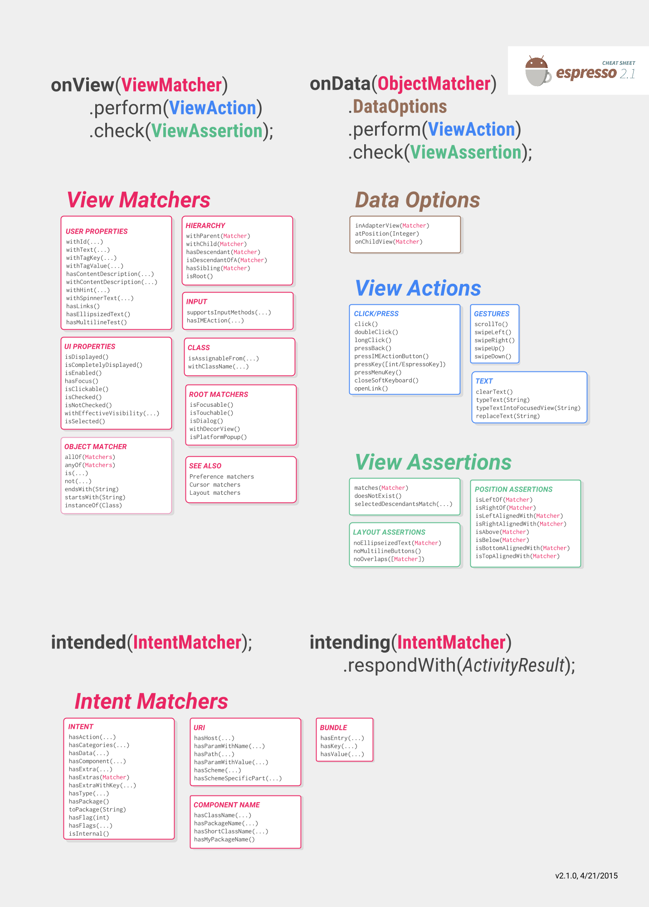

% Android Testing
% Patrick Sturm
% 20.09.2017

## Information

* Any issues with this presentation? Write a ticket or send me a pull request ;).
* Repo: [https://github.com/siyb/tw-epma-1-androidtesting](https://github.com/siyb/tw-epma-1-androidtesting)

# Agenda

## Agenda

* Introduction into JUnit under Android (very basic)
* A few words on testing in general
* Introduction into espresso
* Example Code

# Introduction

## Introduction - 1 - Android Testing

* The Android test framework is build on top of JUnit
* The framework provides Android specific API that we can use to conduct more specialized tests
* In todays session, we are going to look at UI tests, since they are intrinsic to Android, we will not cover regular Unit Testing

## Introduction - 2 - "Testing" in general

* The order in which tests execute is not guaranteed
* Test must therefore not depend on one another
* Test must be deterministic and must not rely on other code then the code to be tested
  * use mocks
* Each test must run in a clean environment, reset the context before or after each test (I mean that quite literally!)
* Don't test external dependencies or framework / language fundamentals
  * One can assume that Boolean.TRUE is in fact Boolean.TRUE
* Only test a single thing (I dare to say Unit here, although it's not entirely true) at a time

## Introduction - 3 - Android Setup

* Before we start:
  * Enable the developer mode on your test device (click "Build Number" several times)
  * Disable all animations:
    * Window
    * Transition
    * Animator

## Introduction - 4 - Android Setup cont.

* Android uses ```InstrumentationTestRunner```, actually an ```Instrumentation``` to execute ```TestCase```s
* We need to specify which ```InstrumentationTestRunner``` to use, e.g.:
  * android.test.InstrumentationTestRunner
    * For regular applications
  * com.android.test.runner.MultiDexTestRunner
    * For MultiDex applications (applications that exceed the initial Dex method limit of 65536)
  * android.support.test.runner.AndroidJUnitRunner
    * We will be working with this runner (support package!)

## Introduction - 5 - Android Setup cont.

* Since the time gradle became the primary Android build system, it's customary to provide the InstrumentationTestRunner instance to use within the build file (before Manifest) - It's all the same really
* ```testInstrumentationRunner "android.support.test.runner.AndroidJUnitRunner"```

## Introduction - 6 - Android Setup cont.

* We also need to include the following dependencies in our project, include them with ```androidTestCompile```:

```
'junit:junit:4.12'
'com.android.support:support-annotations:23.1.1'
'com.android.support.test:runner:0.4.1'
'com.android.support.test:rules:0.4.1'
'com.android.support.test.espresso:espresso-core:2.2.1'

// optional, moar matchers

'org.hamcrest:hamcrest-library:1.3'

```

# Espresso

## Espresso - 1 - Cheat Sheet



## Espresso - 2 - Basic API

* Espresso knows:
  * Matchers - find / (help) inspect views
    * Actions - perform actions on views (e.g. click)
    * Assertions - inspect views
    * Options (adapters only!) - Adapter specific options

## Espresso - 3 - Basic API

* onView(MATCHER)/onData(MATCHER) -> perform(ACTION) -> check(ASSERTION)
* onView(MATCHER)/onData(MATCHER) -> check(ASSERTION)

## Espresso - 4 - Basic API

* In order to use Espresso to do UI testing, we have to do the following
  * Extend ```ActivityInstrumentationTestCase2``` (JUnit TestCase) - alternativly we can utilize @Rule hooks
  * Inject the Instrumentation we obtain from the ```InstrumentationRegistry```
  * Start an Activity and maybe Fragment
* More on the topic in ...
    

# [Example Code](https://github.com/SphericalElephant/android-example-androidtesting)

## More Resources

* https://google.github.io/android-testing-support-library/
* http://chiuki.github.io/advanced-android-espresso/#/

# Any Questions?
